# This is a complete E-Commerce Applicaton with admin pannel

<h2 style="color:red">Here I used</h2>

<li style="color:gold">Provider</li>
<li style="color:gold">Get x
    <ul style="color:cyan">Get Storage</ul>
</li>
<li style="color:gold">
    Mongo Database
        <ul style="color:cyan">Login</ul>
        <ul style="color:cyan">Signup with gmail</ul>
        <ul style="color:cyan">CRUD operation</ul>
</li>
<li style="color:gold">
    Back-end by node.js
    <ul style="color:cyan">CRUD Api</ul>
</li>
<li style="color:gold">Flutter login package</li>
<li style="color:gold">Animation package(For navigate screen smoothly)</li>

<h3>Admin Panel(Product)</h3>
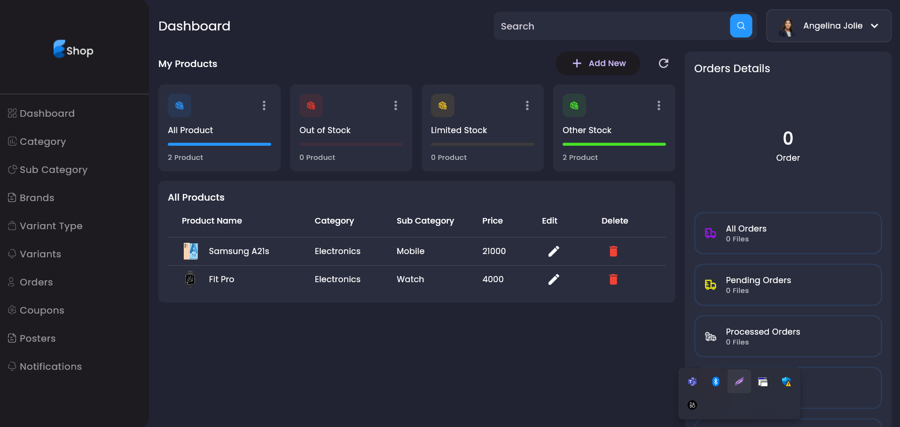

<h3>Admin Panel(Add Product)</h3>
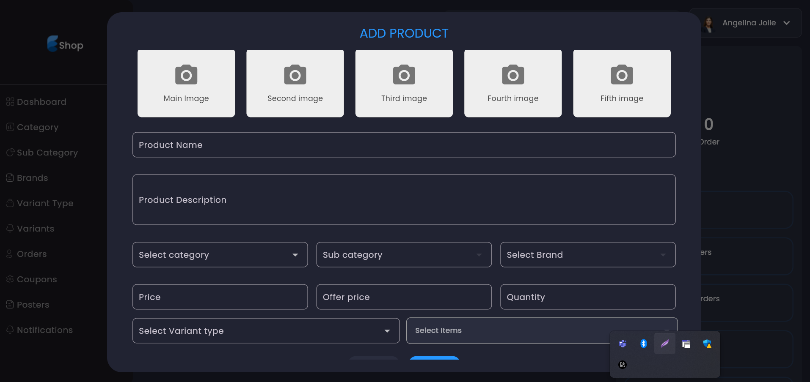

<h3>Admin Panel(Catagory)</h3>
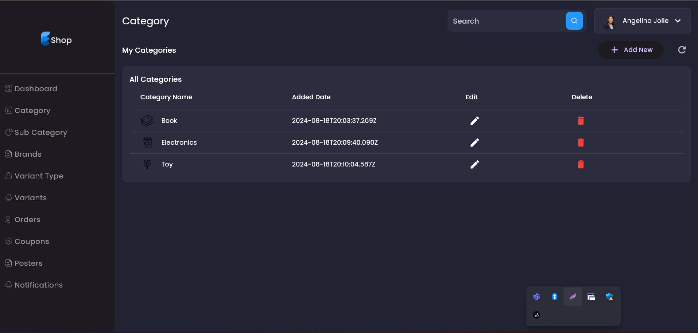

<h3>Login Screen</h3>
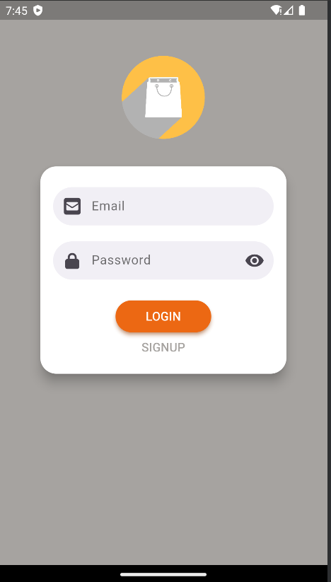

<h3>Home Screen</h3>
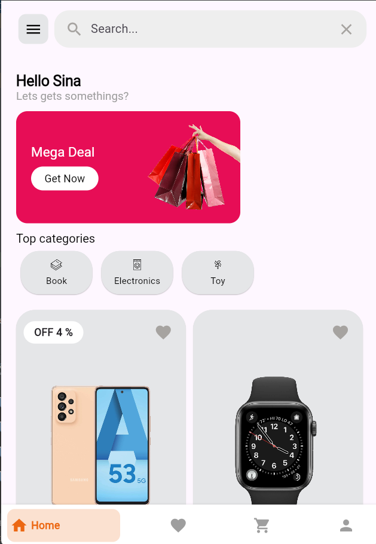

<h3>Product Details</h3>
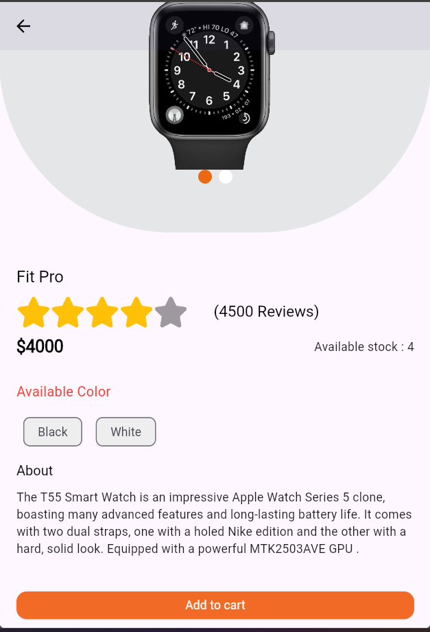

<h3>Favorite Screen</h3>
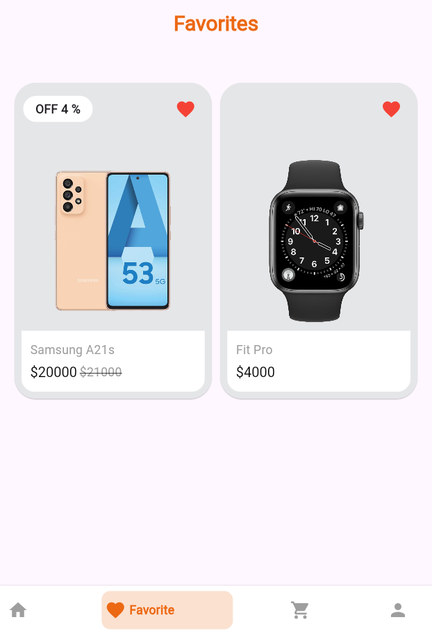

<h3>Cart Screen</h3>
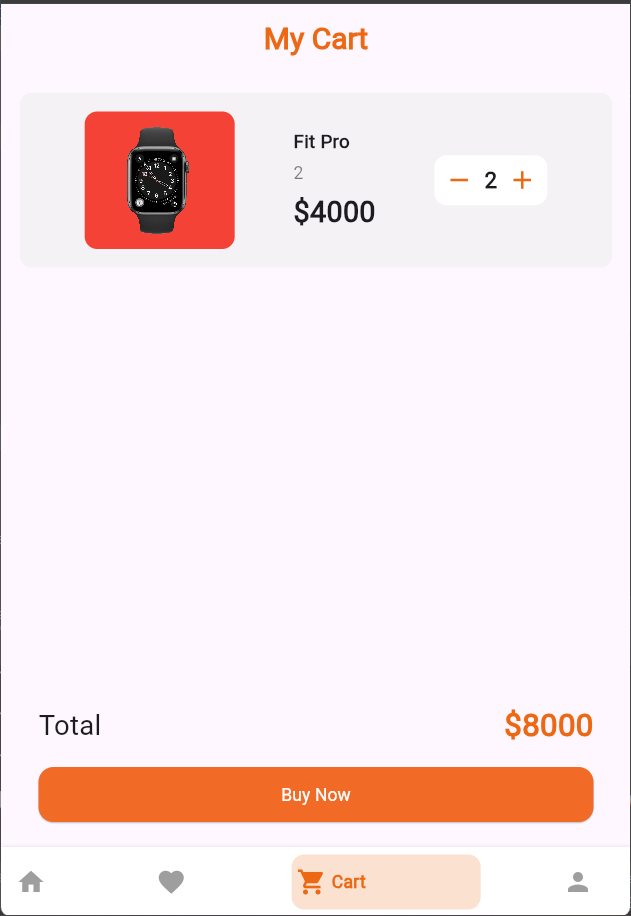

<h3>Cart Screen</h3>
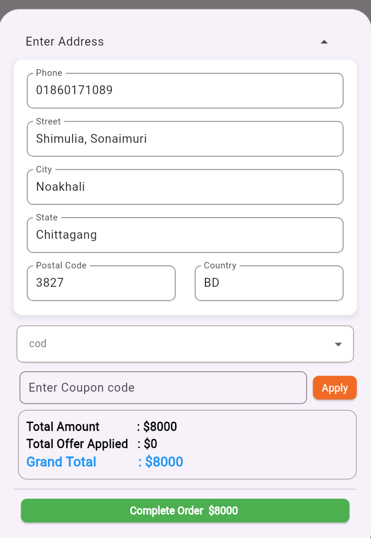

<h3>Profile Screen</h3>
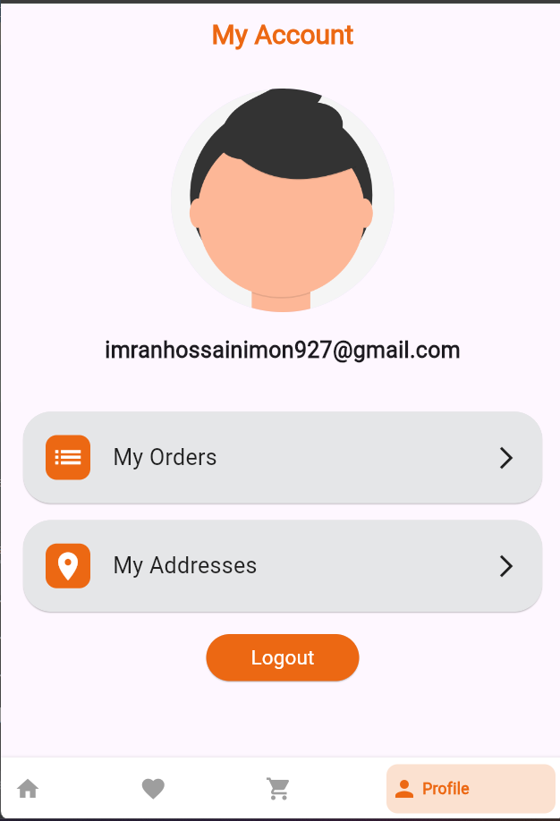

<h3>Add address</h3>
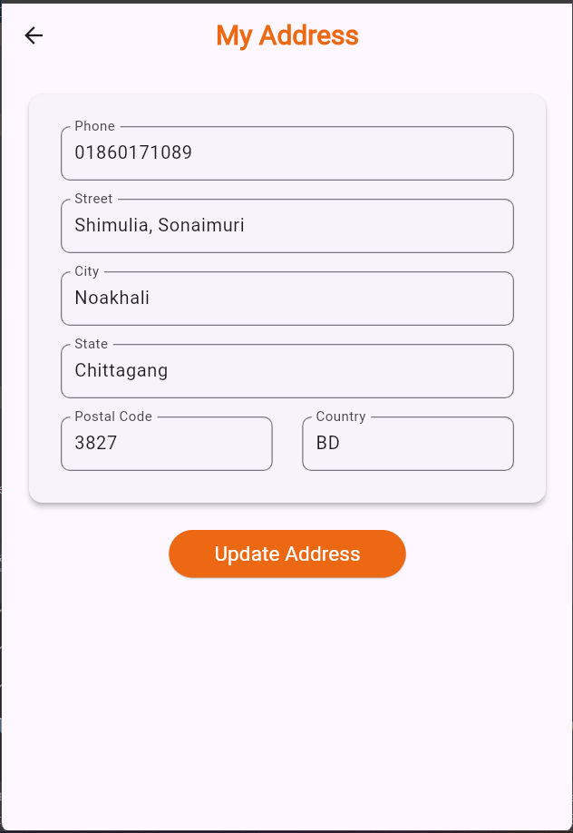